# Access container home page

## Introduction

This lab walks you through the steps to access the container home page from Oracle Enterprise Manager (Oracle EM). You will also learn how to switch between containers and manage your favorites.

Estimated time: 15 minutes

### Objectives

 - Access the container home page from Oracle EM.
 - Switch between home pages for Container Database (CDB), Pluggable Database (PDB), and the database instance.
 - Check out the history
 - Add pages to and remove pages from favorites.

### Prerequisites

This lab assumes you have -

 -   An Oracle Cloud account
 -   Completed all previous labs successfully
 -   Logged in to Oracle EM in a web browser as *sysman*

## Task 1: Access container home page

In this task, you will access the home page for the database instance, *orcl.us.oracle.com*.

1.  From the **Targets** menu at the top, select **Databases** to open the Databases page.

    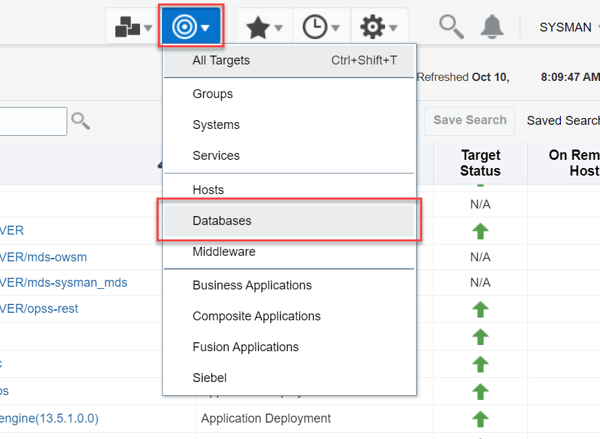

    The Databases page displays all database systems added to Oracle EM as managed targets. The values may differ depending on the system you are using.

1.  Click the expand/collapse triangle next to the database instance name and then expand the Pluggable Databases. The list displays all PDBs under the selected container.   
	The values may differ depending on the system you are using.  

    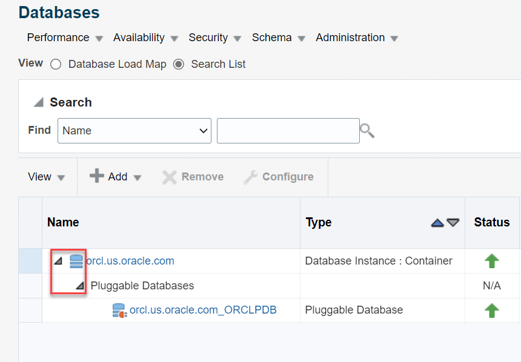

	You can click an item in the **Name** column to access the corresponding home page, that is, the database instance home page or PDB home page.

1.  For this task, click the database instance name, for example *orcl.us.oracle.com*, to access the instance home page.   
	The values may differ depending on the system you are using.  

    

	Similarly, if you click the PDB name, then it opens the PDB home page.

You can perform various tasks depending on which home page you access. For example, from the database instance home page, you can monitor and administer your Oracle Database, such as start up and shut down the database instance, open and close PDBs, manage the memory, modify initialization parameters, and so on.

From the CDB and the PDB home page, you can perform administrative tasks on the CDB and the PDB respectively.

## Task 2: Switch between containers

You can alter session and switch between containers in Oracle EM within the same login.

That is, from the database instance home page, you can switch to the CDB or PDB home page without logging out of Oracle EM. Similarly, from the PDB home page, you can switch to the CDB or to another PDB, if you have more target PDBs in Oracle EM.

In this task, you will switch between containers and open the CDB, the PDB, and the database instance homne page.

1. On the container home page, click the down arrow next to the container name and select **All Containers**.   
	The values may differ depending on the system you are using.  

    

1.  In the Switch Container dialog box, select the CDB, *CDB$ROOT*, from the containers list and click **OK**.   
	The values may differ depending on the system you are using.  

	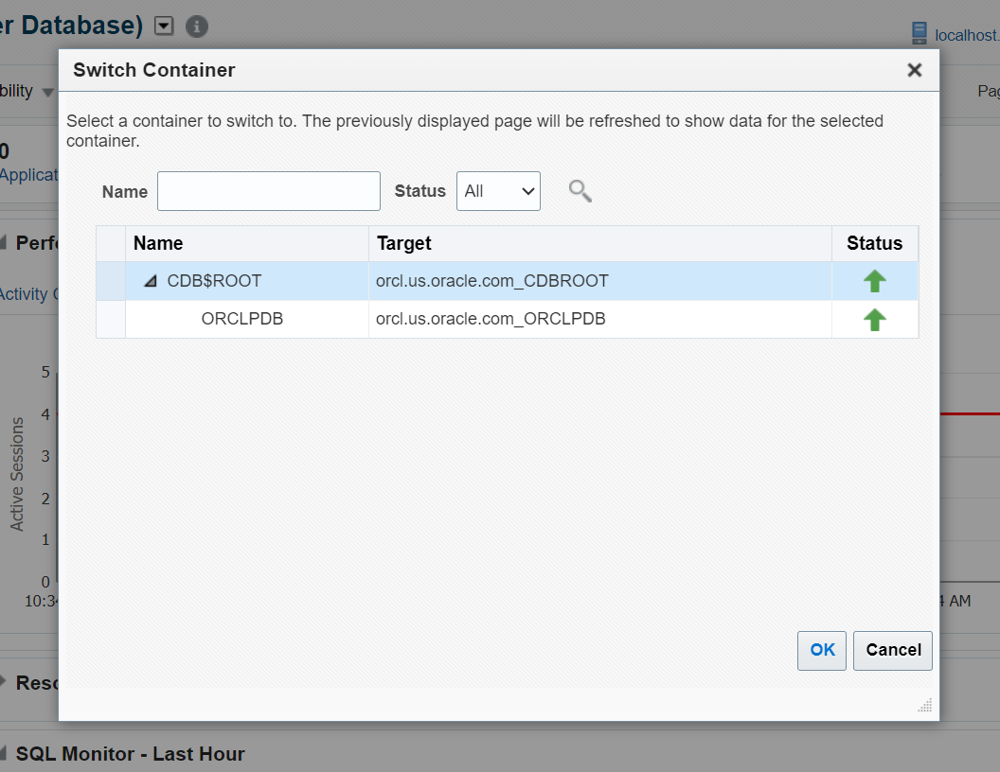

	It brings up the CDB home page. The values may differ depending on the system you are using.  

    

	Similarly, follow the same steps to open the PDB home page.

1.  Click the down arrow next to the CDB name and select **All Containers**.   
	The values may differ depending on the system you are using.  

    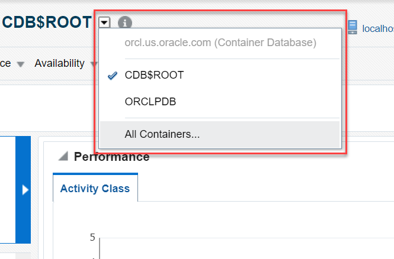

1. 	 In the Switch Container dialog box, select the PDB, for example *ORCLPDB*, from the containers list and click **OK**. The values may differ depending on the system you are using.  

    

	It brings up the PDB home page. The values may differ depending on the system you are using.  

    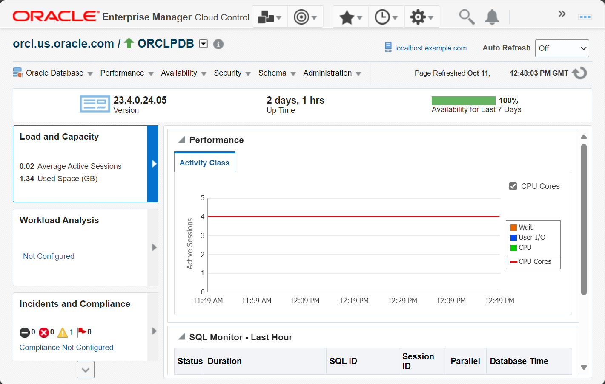

	> **Note:** The Switch Container option is useful if you have many containers in your database instance. However, you can move directly from one container to another instead of going through this option.

1.	On the PDB home page, click the down arrow next to the PDB name and select the CDB, *CDB$ROOT*.    
	The values may differ depending on the system you are using.  

    

	It opens the CDB home page. The values may differ depending on the system you are using.

    

	> **Note:** From the CDB or the PDB home page, you cannot open the database instance home page directly. However, if you have opened the database instance home page recently, then you can access it again using the **History** menu. Alternatively, you can access the database instance home page from the Databases page.

1.	Click the **History** menu at the top and select the database instance name, *orcl.us.oracle.com*.   
	The values may differ depending on the system you are using.

    

	It opens the database instance home page. The values may differ depending on the system you are using.

    

	> **Note:** You can open a recently visited page from any location in Oracle EM using the **History** menu.

## Task 3: View target information

To view information about a target or to monitor a target, open the target home page. From the home page, you can view details about the target, such as the Oracle home location, agent details, host system, listener information, and so on. 

In this task, you will view target information for the database instance, the CDB, and the PDB.

1.  On the container home page, from the **Oracle Database** menu, select **Target Information** to view details of the database instance.   
	The values may differ depending on the system you are using.

    

    Alternatively, you can also click the target information icon (the circle with an 'i' in it) next to the container name. The values may differ depending on the system you are using.

    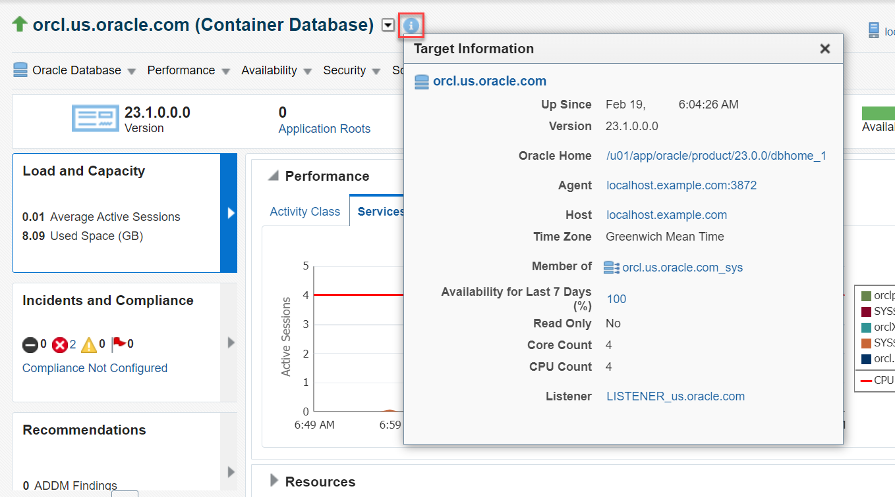

	Press **Esc** on your keyboard or click the cross (x) icon on the Target Information window to close it.

1.  Click the down arrow next to the database instance name and select the CDB, *CDB$ROOT* to go to the CDB home page.    
	The values may differ depending on the system you are using.

    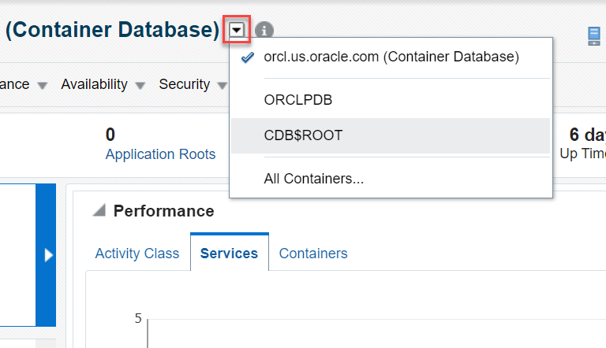

1.  On the CDB home page, from the **Oracle Database** menu, select **Target Information** to view details of the CDB.  
	The values may differ depending on the system you are using.

    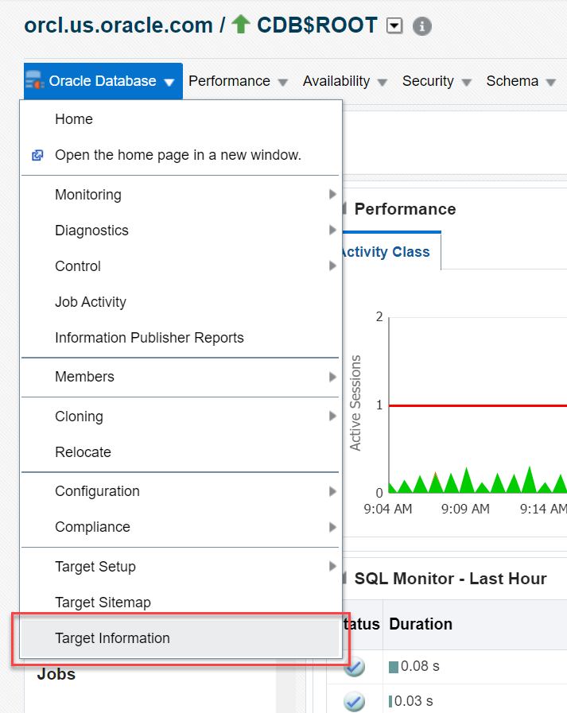

    Alternatively, you can click the target information icon (the circle with an 'i' in it) next to the CDB name, *CDB$ROOT*. The values may differ depending on the system you are using.  

    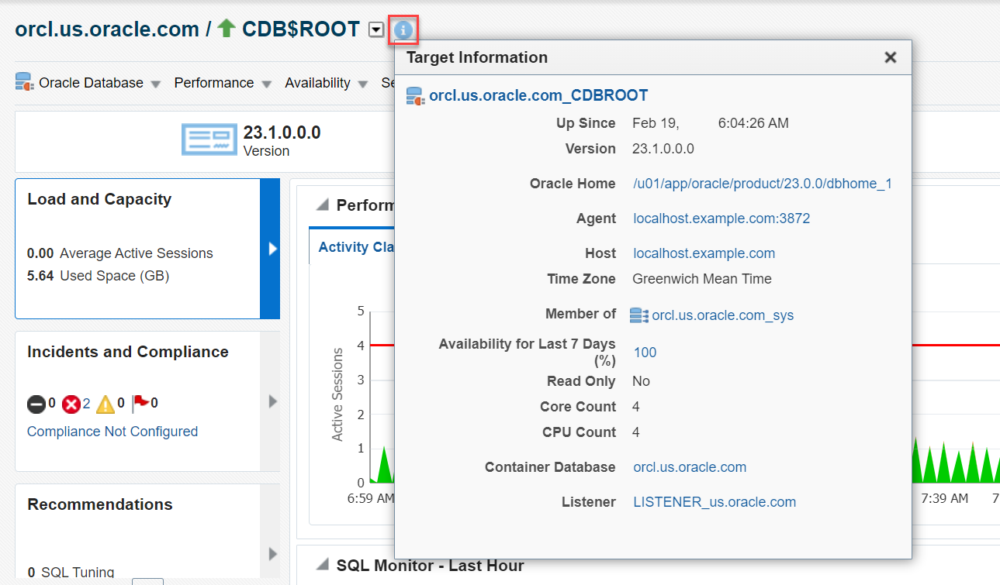

	Press **Esc** on your keyboard or click the cross (x) icon on the Target Information window to close it.

1.  Click the down arrow next to the CDB name and select the PDB, *ORCLPDB* to go to the PDB home page.   
	The values may differ depending on the system you are using.

    

1.  On the PDB home page, from the **Oracle Database** menu, select **Target Information** to view details of the target PDB.    
	The values may differ depending on the system you are using.

    

    Alternatively, you can click the target information icon (the circle with an 'i' in it) next to the PDB name, *ORCLPDB*. The values may differ depending on the system you are using.

    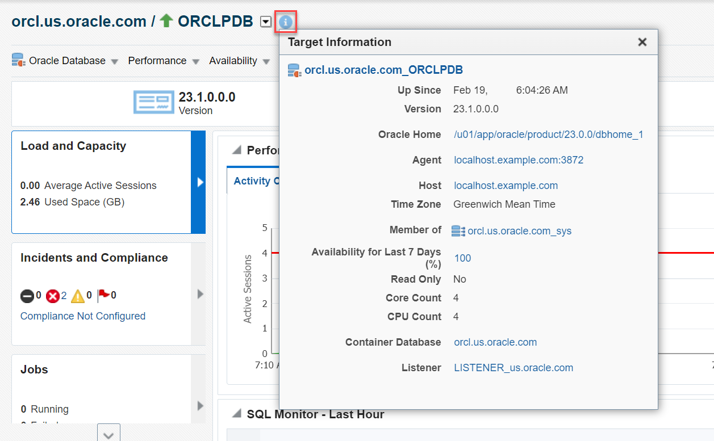

	Press **Esc** on your keyboard or click the cross (x) icon on the Target Information window to close it.

## Task 4: Manage favorites

Using the favorites option, you can bookmark pages in Oracle EM for quick access.

> **Note:** Go to the page that you want to add to or remove from favorites.

In this task, you will add the CDB home page and the PDB home page to favorites and then remove the CDB home from favorites. Currently, you are on the PDB home page.

1. Add the PDB home page to favorites. Click the **Favorites** menu (star icon) at the top and select **Add Page to Favorites**.

    

    The window displays a confirmation message indicating that you have added the current page to favorites.   

1.  Go to the CDB home page. Click the down arrow next to the PDB name and select the CDB, *CDB$ROOT*.    
	The values may differ depending on the system you are using.

    

1. Add the CDB home page to favorites. Click the **Favorites** menu (star icon) and select **Add Page to Favorites**.   
	The values may differ depending on the system you are using.

    

1.	Click the **History** menu at the top and select the database instance name, *orcl.us.oracle.com*.   
	The values may differ depending on the system you are using.

    

	It opens the database instance home page. The values may differ depending on the system you are using.

1. Add the database instance home page to favorites. Click the **Favorites** menu (star icon) and select **Add Page to Favorites**.   
	The values may differ depending on the system you are using.

    

    You have added the PDB, the CDB, and database isntance home pages to favorites. Similarly, you can remove pages from favorites. Currently, you are on the database instance page.

1.  Remove the database instance home page from favorites. Click the **Favorites** menu (star icon) and select **Remove Page from Favorites**.  
	You will notice that the menu displays the CDB, the PDB, and the database instance as favorites.    

	The values may differ depending on the system you are using.  

    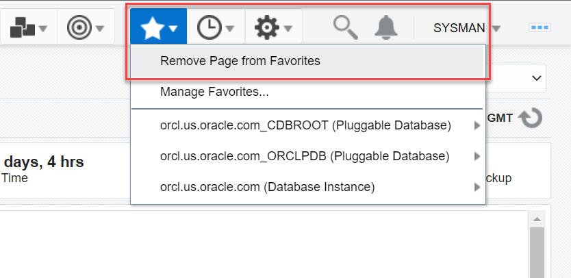

    The window displays a confirmation message indicating that you have removed the page from favorites. You can also remove favorites using the **Manage Favorites** option.

1.	Click the **Favorites** menu (star icon) and select **Manage Favorites**.   
	The values may differ depending on the system you are using.  

    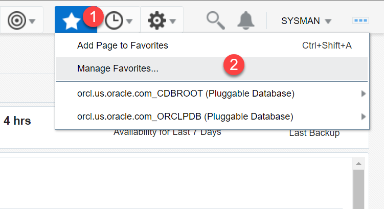

1.  In the **Manage Favorites** dialog box, select the page that you want to remove. For example *CDBROOT*, and click **Remove Selected**.    
	The values may differ depending on the system you are using.  

    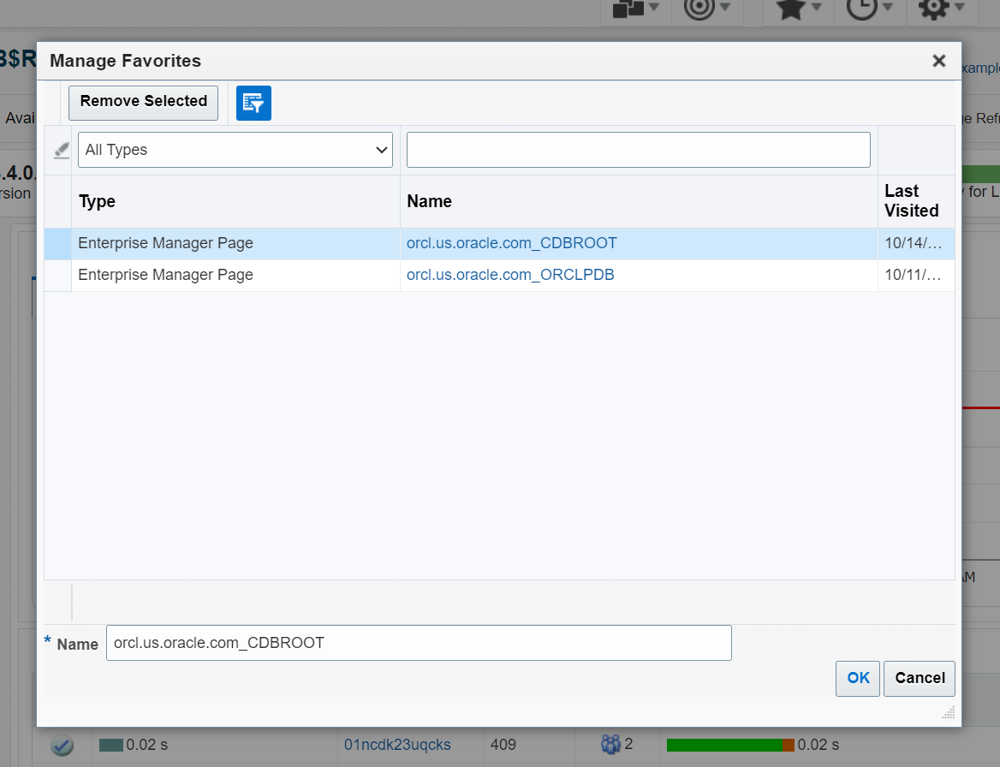

	Click **OK** to remove the CDB home page from favorites.

	> **Note:** In the **Manage Favorites** dialog box, you can select pages one-by-one and then click **Remove Selected**. Finally, when you click **OK**, it removes the pages from favorites.

Congratulations! You have successfully completed of this workshop on *Oracle EM Database Administration (DBA)*.

In this workshop, you performed some basic administration of Oracle Database from Oracle EM.
 - Viewed container details from the SQL command line
 - Administered managed targets in Oracle EM
 - Learned how to add and remove Oracle Database and Listener as targets
 - Accessed the database instance, CDB, and PDB home pages
 - Learned how to switch between containers
 - Added and removed favorites in Oracle EM
 - Learned how to check the recent history

## Acknowledgements

 - **Author**: Manish Garodia, Database User Assistance Development team
 - **Contributors**: <if type="hidden">Suresh Rajan, Ashwini R, Jayaprakash Subramanian, Steven Lemme</if>
 -   **Last Updated By/Date**: Manish Garodia, March 2023

<!--

 - Lab: Manage Targets - Oracle Database and Listener (Re-add the Oracle Database 21c and the listener managed targets removed at the end of this lab before proceeding).

1.  From the **Targets** menu, select **Databases**. Select the Oracle Database, and click **View** &gt; **Expand All Below** to view the PDBs.

1.  Click the PDB name, for example *ORCLPDB*, to access the PDB home page.   
	The values may differ depending on the system you are using.  

    

1.  On the container home page, if you are on some other page.   
	From the **Targets** menu, select **Databases** to open the Databases page. Click the container name, for example *orcl.us.oracle.com*, to access the container home page as explained in *Task 1* of this lab.   
	The values may differ depending on the system you are using.  

    

1.  click the down arrow next to the container and select **All Containers**.   
	The values may differ depending on the system you are using.  

1.  Open the container home page, if you are on some other page.   
	From the **Targets** menu, select **Databases** to open the Databases page. Click the container name, for example *orcl.us.oracle.com*, to open the container home page as explained in *Task 1* of this lab.   
	The values may differ depending on the system you are using.  

    

Ensure that you have the CDB home page open. Otherwise, follow the steps as explained in *Task 1* of this lab to open the CDB home page.

 - To add a page to favorites, open that page, and use the **Favorites** menu (star icon).
 - To remove a page from favorites, open that page, and use the **Favorites** menu (star icon).
 - To remove one or more pages from favorites, use the **Manage Favorites** menu.

1.  To do that, add the CDB home page to favorites again. Select **Favorites** &gt; **Add Page to Favorites**. The window displays a confirmation message indicating that you have added the current page to favorites.

In this workshop, you performed some basic administration of Oracle Database from Oracle EM. You viewed container details from the SQL command line. You administered managed targets in Oracle EM and learned how to add and remove Oracle Database and Listener as targets. You accessed the database instance, CDB, and PDB home pages and learned how to switch between containers. You also added and removed favorites in Oracle EM and learned how to check the recent history.

-->
