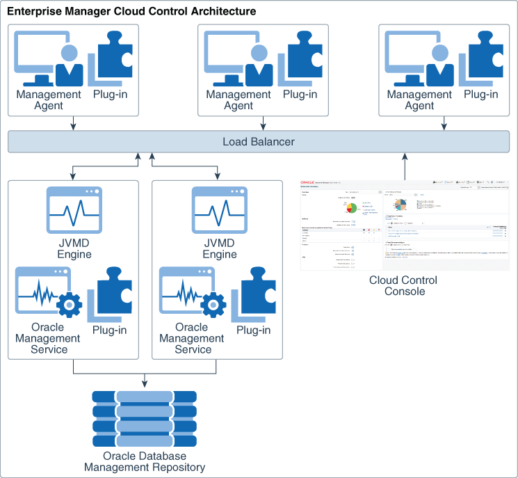

# DB administration with Oracle EM

## About this workshop

After you install Oracle Database on your host, you can connect to the database and perform database administration. In this workshop, you will use Oracle Enterprise Manager (Oracle EM) to administer your Oracle Database.

**What is Oracle EM?**   
Oracle EM is Oracle’s on-premises management solution providing centralized monitoring, administration, and lifecycle management functionality for the complete IT infrastructure. It offers a single dashboard to monitor and manage your entire computing environment from a web-based console.

Oracle EM offers a comprehensive set of performance and health metrics to facilitate unattended monitoring of key components in your environment. These key components include but are not limited to applications, application servers, Oracle Databases, and the back-end components on which they rely, such as hosts, operating systems, storage, and so on.

Estimated workshop time: 1 hour 45 minutes

Watch this video on *Oracle EM Console Overview*.

### Objectives

In this workshop, you will do the following.

 - Connect to SQL prompt and view container details
 - Manage the targets in Oracle EM
 - Access container home pages, view history, and manage favorites

### Prerequisites

This lab assumes you have -
 -   An Oracle Cloud account

## Oracle EM architecture

The following figure shows a sample Oracle EM configuration and illustrates how the core components interact with each other in the architecture.

> **Note:** This figure depicts a load balancer and multiple Oracle Management Service (OMS) instances only to indicate how to deploy Oracle EM in a large organization. They are not prerequisites for an Oracle EM system installation.

If you do not have the load balancer, the Management Agents communicate directly with the OMS instances.

### Oracle EM components

Oracle EM includes the following components:

- **Oracle Management Agent**

    The agent enables you to convert an unmanaged host into a managed host and helps you monitor the targets running on the managed host.

    To learn more about managed hosts, see [What are managed targets and managed hosts?] (?lab=intro-em#Whataremanagedtargetsandmanagedhosts?).

- **Oracle Management Service (OMS)**

    A web-based application to discover, monitor, and manage targets, and to store the collected information in a repository. It also renders the user interface for Oracle EM.

- **Oracle Management Repository**

    A storage location for the information, which the Management Agent collects. It consists of objects such as database jobs, packages, procedures, views, and tablespaces. It organizes the data so that OMS can retrieve and display it on the Oracle EM console.

- **Plug-ins**

    Pluggable entities that help you monitor all types of targets in your environment.

- **Oracle Java Virtual Machine Diagnostics (JVMD) Engine**

    It enables you to diagnose performance problems in Java applications in the environment. It helps in improving application availability and performance.

- **Oracle EM Console**

    The user interface that you see after logging in to Oracle EM. The console helps you monitor and administer your entire computing environment from one location on the network.

- **EMCTL**

    A command-line tool that enables you to run tasks on the OMS and Management Agents. You can use it for tasks, such as starting and stopping OMS instances, setting properties on OMS instances, or getting a list of targets that the Management Agent monitors.

- **EM CLI**

    A command-line tool that is accessible through classic programming language constructs. It helps you create and run tasks from the command-line or by using a program. It enables you to access Oracle EM functionality from text-based consoles (shells and command-line windows) for a variety of operating systems.

## What are managed targets and managed hosts?

You can discover entities and add them to Oracle EM as *targets*. 

For adding targets, Oracle EM provides various options, such as installing an agent, using the guided discovery process, or adding targets manually.

 - **Install an agent** - This is an autodiscovery process in which you install a management agent on an unmanaged host and convert it to a managed host. You can then search for targets on that host and add them to Oracle EM.

	> **Note:** With this process, if you add any new components to your infrastructure in the future, Oracle EM automatically finds and brings them under management.  

 - **Use guided discovery** - This process takes you through a discovery wizard that displays the specifications prefilled by default. The wizard searches for targets, such as Oracle Databases, listeners, and other deployed components or applications on the host. It helps you promote these targets to managed status.
	> The guided discovery process is a quick way to add targets in Oracle EM. 

 - **Add targets manually** - This is a declarative process in which you explicitly specify the monitoring properties required to discover the targets.

	> The manual process is useful if both autodiscovery and the guided process failed to discover a target.

After adding a target, for example Oracle Database, you can monitor and managed it from Oracle EM to perform administrative tasks. Removing a target database instance or database system deletes the entire Oracle Database, including the Container Database (CDB) and Pluggable Databases (PDBs) from Oracle EM. Whereas, if you remove a specific CDB or a PDB, then Oracle EM deletes only that target container and leaves the database instance, database system, and other components intact. 

*Managed hosts* are the host systems where manageable entities reside. Examples of manageable entities are Oracle Databases, Oracle homes, listeners, agents, OMS, Fusion Middleware components, and server targets (hardware) to name a few.

Click the next lab to **Get started**.

## Learn more

 - [Oracle EM documentation](https://docs.oracle.com/en/enterprise-manager/index.html)
 - [Oracle EM Release Notes](https://docs.oracle.com/en/enterprise-manager/cloud-control/enterprise-manager-cloud-control/13.5/emrel/cloud-control-release-notes-emrel.html#GUID-42C87BBB-CA6D-4A5E-8B59-AA94755724E0)
 - [Oracle Database documentation](https://docs.oracle.com/database/oracle/oracle-database/index.html)

## Acknowledgments

 - **Author**: Manish Garodia, Database User Assistance Development team
 - **Contributors** - <if type="hidden">Suresh Rajan, Steven Lemme, Ashwini R</if>
 - **Last Updated By/Date** - Manish Garodia, March 2023
